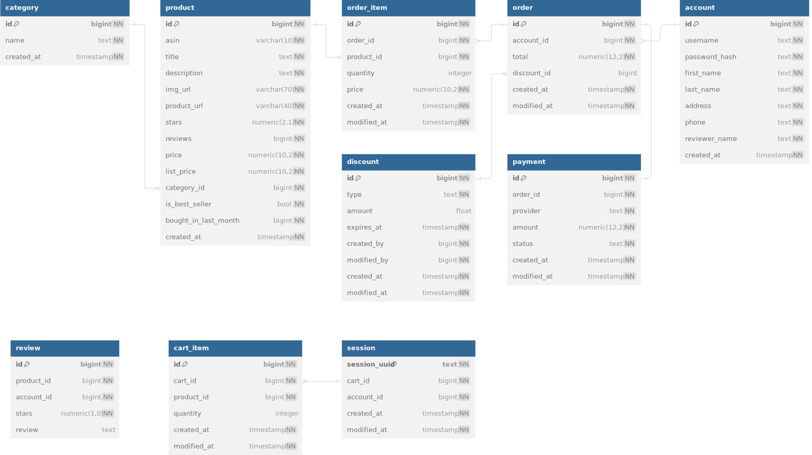

# ecommerce db demo using amazon product data

### local database info

The ecommerce demo database features tables for products, accounts, sessions, carts, orders and payments. Implemented using PostgreSQL.

:link: [View schema on dbdiagram.io](https://dbdiagram.io/d/ecommerce-demo-65eaf17fb1f3d4062c72cba2)



Run local db using Docker:

```
docker compose -f ecommerce/amazon/docker-compose.yml up
```

Clean up local docker image:

```
docker-compose -f ecommerce/amazon/docker-compose.yml down --volumes
```


### Source info
Kaggle dataset: [Amazon Products Dataset 2023 (1.4M Products)](https://www.kaggle.com/datasets/asaniczka/amazon-products-dataset-2023-1-4m-products)

downloaded: 2024-03-07 13:46 GMT
license: [ODC Attribution License v1.0](https://opendatacommons.org/licenses/by/1-0/index.html)

